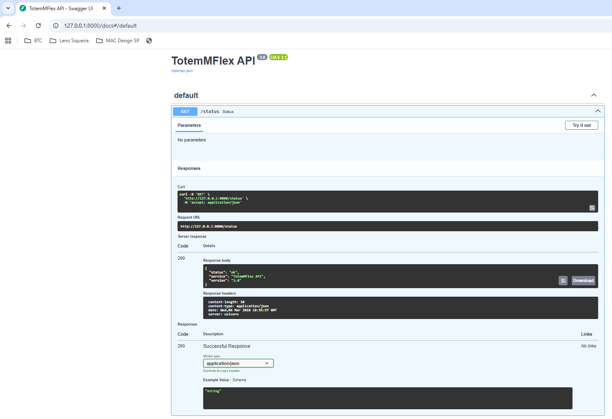
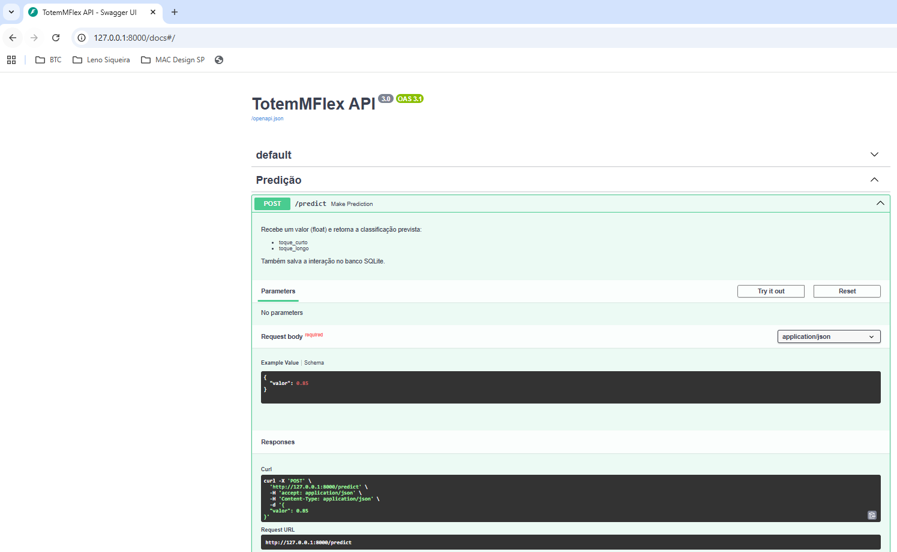
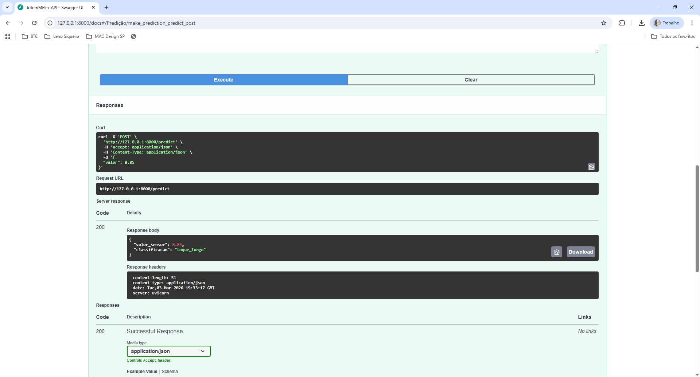
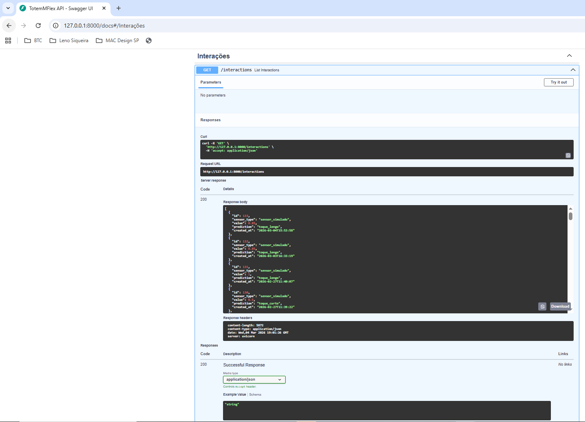
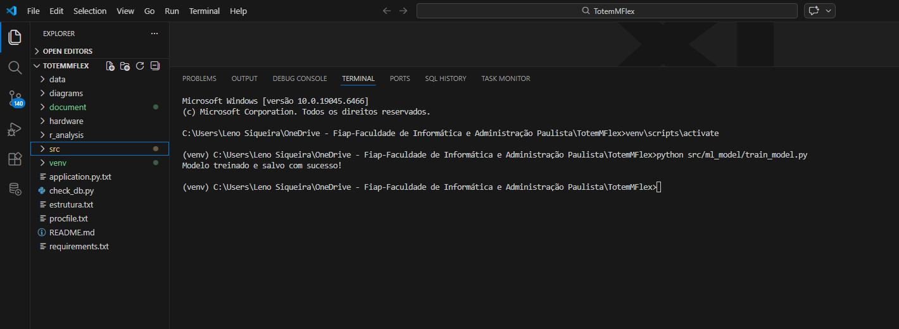
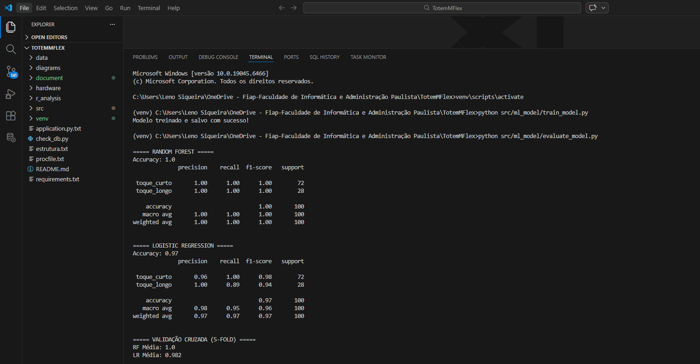
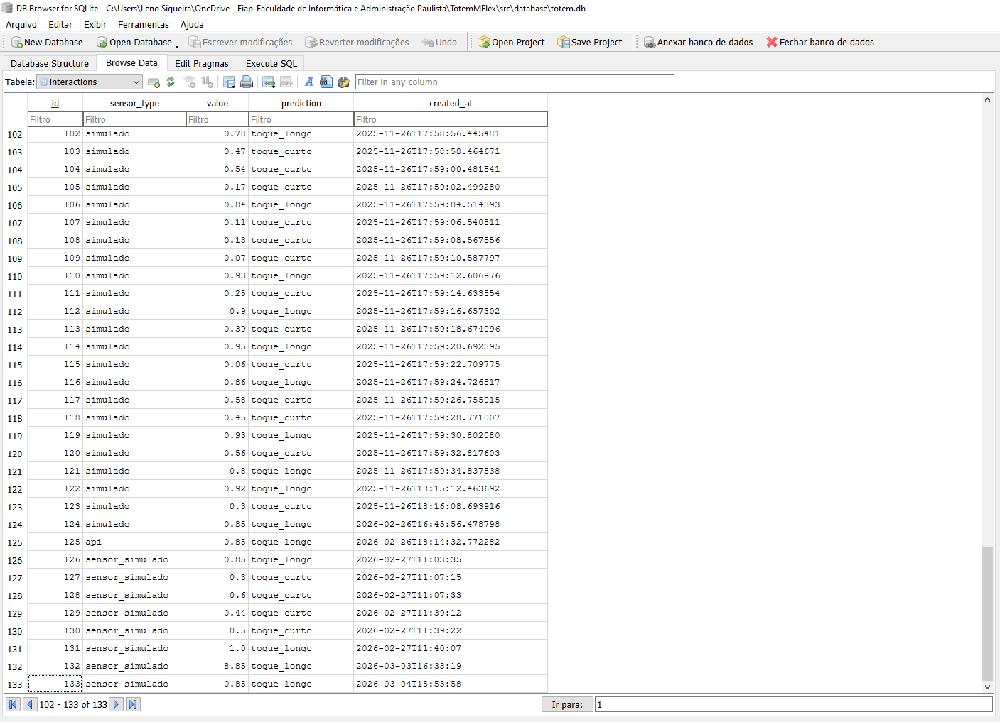
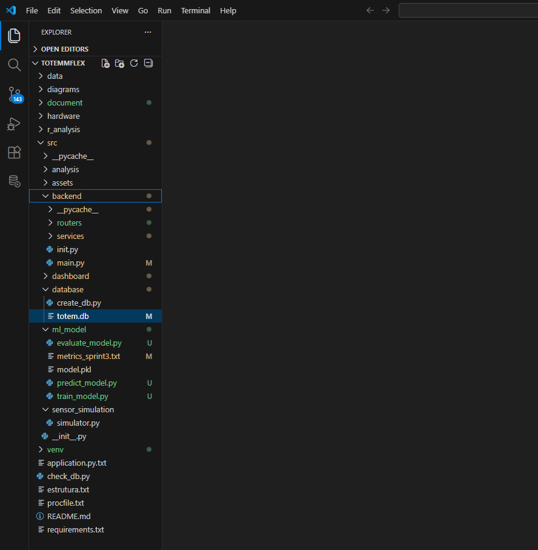
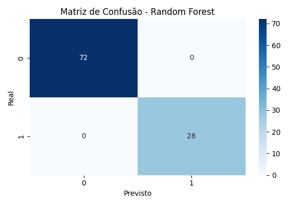
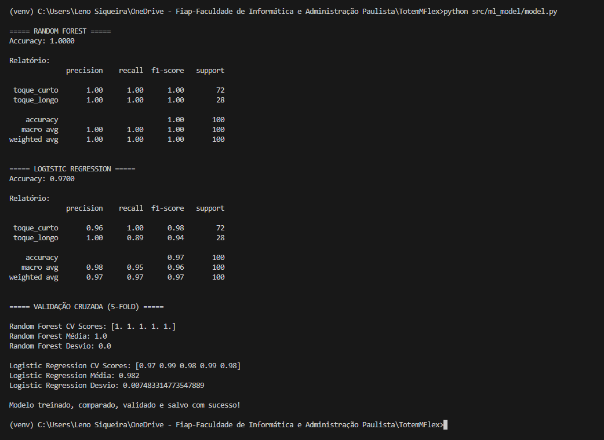

# 🟦 FIAP - Faculdade de Informática e Administração Paulista

  

# 🟩 TotemMFlex – Sistema Inteligente de Engajamento Corporativo

**Challenge FlexMídia — FIAP 2025**

📌 **Repositório Oficial (Privado):**  
https://github.com/lnosiqueira/TotemMFlex

---

## 👨‍🎓 Integrantes — Grupo S (Turma 55)

- <a href="https://www.linkedin.com/in/leno-siqueira-36789544?utm_source=share_via&utm_content=profile&utm_medium=member_ios">Leno Siqueira</a> — RM: 567893  
- <a href="https://www.linkedin.com/in/paulo-benfica-76057a7b">Paulo Benfica</a> — RM: 567648  
- <a href="https://www.linkedin.com/in/federico-villagra-97378838a">Fred Villagra</a> — RM: 567187  
- <a href="https://www.linkedin.com/in/math-penteado-1b4807200/">Mateus Lima</a> — RM: 568518  

---

## 👩‍🏫 Professores Responsáveis

### Tutor(a)
- <a href="https://www.linkedin.com/in/sabrina-otoni-22525519b?utm_source=share_via&utm_content=profile&utm_medium=member_ios/">Sabrina Otoni FIAP</a>

### Coordenador(a)
- <a href="https://www.linkedin.com/company/inova-fusca/">André Godoi FIAP</a>

---

## Visão Geral

O TotemMFlex é um sistema inteligente que coleta interações simuladas de sensores, processa os dados utilizando Machine Learning e disponibiliza os resultados através de uma API REST.

O sistema integra:

- Simulação de sensores
- Persistência em banco SQLite
- Machine Learning com Scikit‑Learn
- API REST com FastAPI
- Dashboard de visualização

---

## Pipeline

Sensor → API → Machine Learning → Banco de Dados → Histórico → Dashboard

---

## Estrutura do Projeto

TotemMFlex/

src/
backend/
routers/
services/
main.py

database/
create_db.py
totem.db

ml_model/
train_model.py
evaluate_model.py
predict_model.py
model.pkl

sensor_simulation/
simulator.py

dashboard/

---

## Tecnologias

Python  
FastAPI  
SQLite  
Scikit‑Learn  
Streamlit  
Uvicorn  
Pandas

---

## Como Executar

### Ativar ambiente virtual

venv\Scripts\activate

### Instalar dependências

pip install -r requirements.txt

### Executar API

uvicorn src.backend.main:app --reload

API:

http://127.0.0.1:8000

Swagger:

http://127.0.0.1:8000/docs

---

### Executar simulador

python src/sensor_simulation/simulator.py

---

### Treinar modelo

python src/ml_model/train_model.py

---

# 📊 Evidências da Sprint 3

## API em execução

---

## Endpoint de Predição

---

## Resposta da Predição

---

## Histórico de Interações

---

## Treinamento do Modelo

---

## Comparação de Modelos

---

## Banco SQLite

---

## Estrutura do Projeto

---

# 📊 Avaliação do Modelo

## Matriz de Confusão

## Comparação de Modelos

---

# 📘 Histórico de Evolução por Sprints

- [Sprint 1](document/sprint1/README_SPRINT1.md)
- [Sprint 2](document/README_SPRINT2.md)
- [Sprint 3](document/README_SPRINT3.md)

---

## Conclusão

O projeto demonstra um pipeline completo de dados:

coleta → processamento → classificação → armazenamento → visualização

Sistema integrado validado localmente e em nuvem, com modelo preditivo, análise estatística e score operacional aplicado.

O TotemMFlex consolida conceitos de engenharia de software, ciência de dados e arquitetura em nuvem, demonstrando aplicabilidade prática em ambiente corporativo.
