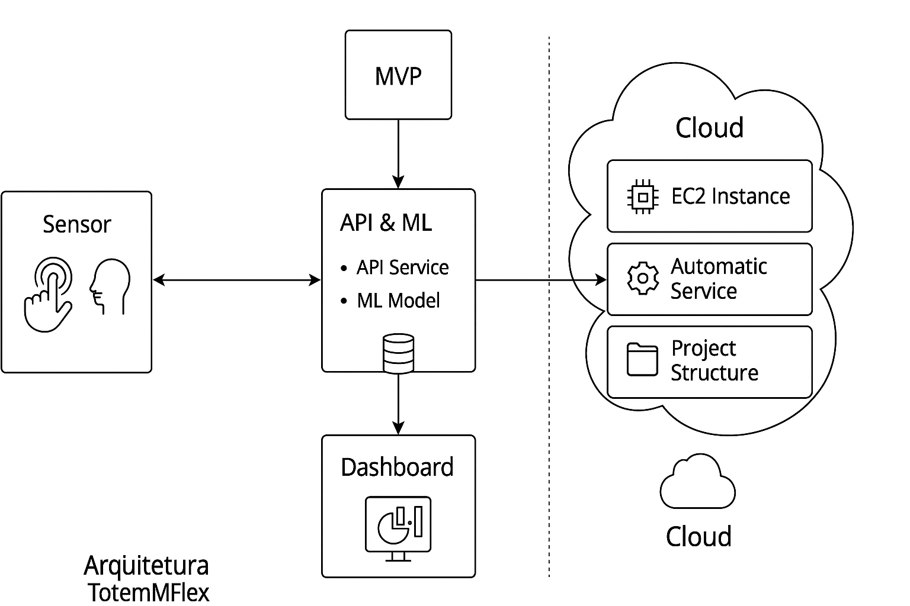
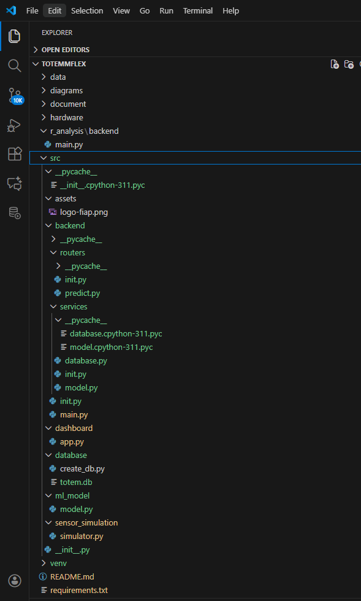
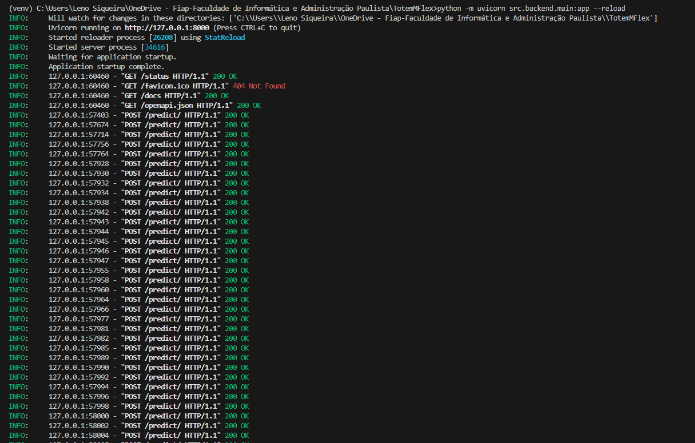
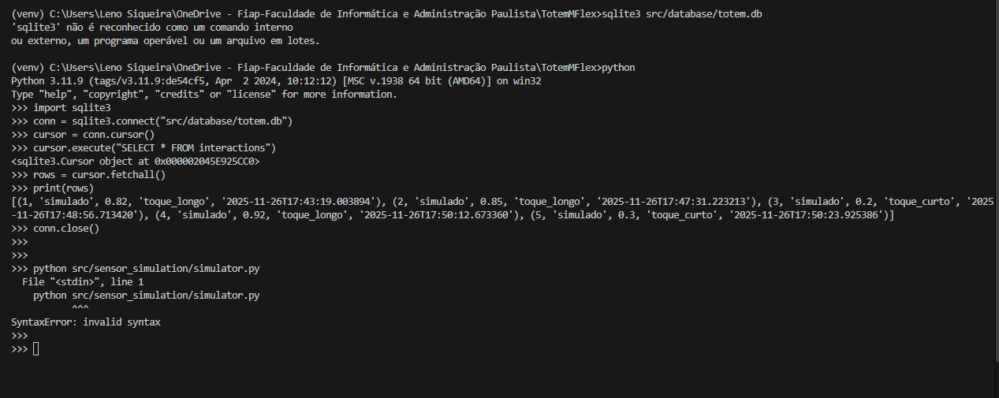
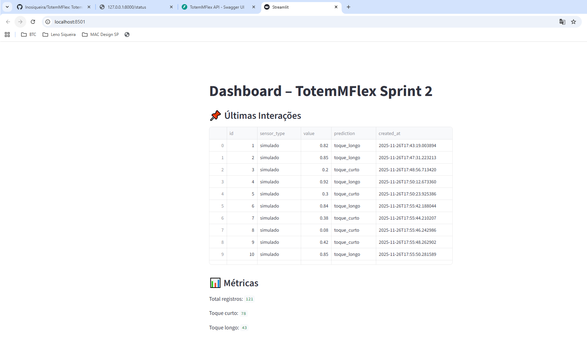
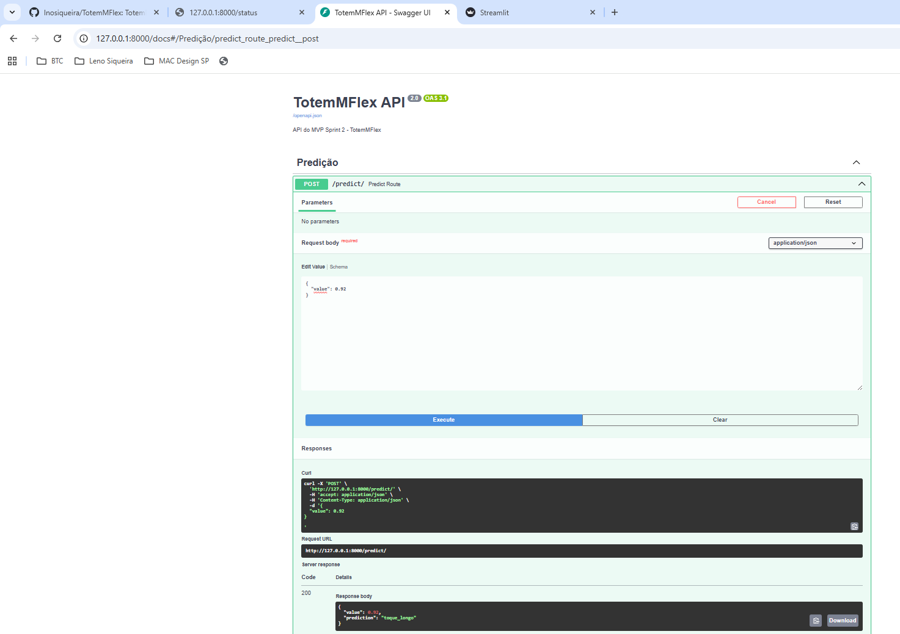
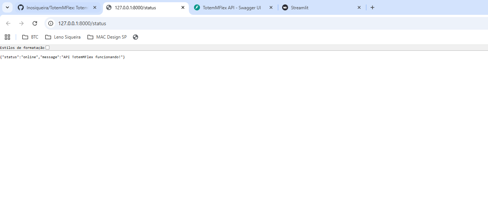

# FIAP - Faculdade de Informática e Administração Paulista

<p align="center">
  <a href="https://www.fiap.com.br/">
    
  </a>
</p>

# TotemMFlex – Evolução do Totem‑IA Educacional  
### *Sprint 2 – Sistema Inteligente de Engajamento Corporativo*

> **Observação:**  
> O TotemMFlex é a **evolução direta** do projeto **Totem‑IA Educacional**, entregue na Sprint 1.  
> O arquivo oficial da Sprint 1 (**README_SPRINT1.md**) encontra‑se em:  
> `document/README_SPRINT1.md`

---

## 👨‍🎓 Integrantes — Grupo S (Turma 55)

- Leno Siqueira — RM: 567893  
- Paulo Benfica — RM: 567648  
- Fred Villagra — RM: 567187  
- Mateus Lima — RM: 568518  

---

## 👩‍🏫 Professores Responsáveis

### Tutor(a)
- Sabrina Otoni – FIAP

### Coordenação
- André Godoi – FIAP

---

# 📜 Descrição Geral

O **TotemMFlex** representa a **segunda fase** do projeto iniciado na Sprint 1.  
Se antes o Totem‑IA Educacional tinha foco acadêmico, agora o TotemMFlex evolui para um **ecossistema corporativo inteligente**, incluindo:

- Backend FastAPI  
- Pipeline de predição (ML simplificado)  
- Simulação de sensores em tempo real  
- Banco SQLite persistindo interações  
- Dashboard Streamlit monitorando métricas  
- Arquitetura modular  
- Preparação para integração futura com Azure e serviços corporativos  

---

# 🧱 Arquitetura – Sprint 2



---

# 🔄 Fluxo de Dados


---

# 📁 Estrutura Atualizada do Projeto

```
src/
 ├── assets/
 │    ├── logo-fiap.png
 │    └── prints/
 │         ├── api_backend_logs.png
 │         ├── api_status.png
 │         ├── dashboard_main.png
 │         ├── database_select.png
 │         ├── project_structure.png
 │         ├── simulator_running.png
 │         ├── swagger_predict_curto.png
 │         └── swagger_predict_longo.png
 │
 ├── backend/
 │    ├── main.py
 │    ├── routers/predict.py
 │    └── services/
 │         ├── database.py
 │         └── model.py
 │
 ├── dashboard/app.py
 ├── sensor_simulation/simulator.py
 ├── database/totem.db
 └── ml_model/model.py
```

---

# 🚀 Backend – FastAPI

Logs da inicialização da API:



---

## 🔎 Endpoint `/status`


---

## 🔮 Endpoint `/predict`

### Predição — exemplo 1  


### Predição — exemplo 2  


---

# 🗃 Banco de Dados (SQLite)

Consulta a registros armazenados:



---

# 📡 Simulador de Sensores



---

# 📊 Dashboard – Streamlit



---

# ▶️ Como Executar o Projeto

1. Ativar venv  
```
venv\Scripts\activate
```

2. Instalar dependências  
```
pip install -r requirements.txt
```

3. Rodar API  
```
uvicorn src.backend.main:app --reload
```

4. Rodar simulador  
```
python src/sensor_simulation/simulator.py
```

5. Rodar dashboard  
```
streamlit run src/dashboard/app.py
```

---

# 📘 Referência da Sprint 1

Arquivo original:  
`document/README_SPRINT1.md`

---

# 🏁 Conclusão

A Sprint 2 entregou um MVP completo com backend, ML, dashboard e simulação — uma evolução sólida rumo ao produto final.

