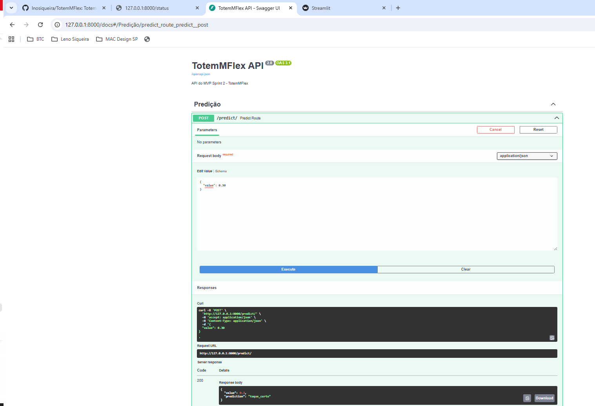
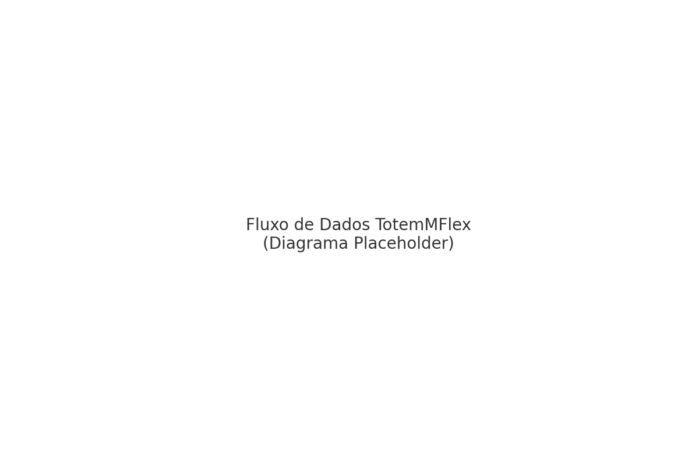
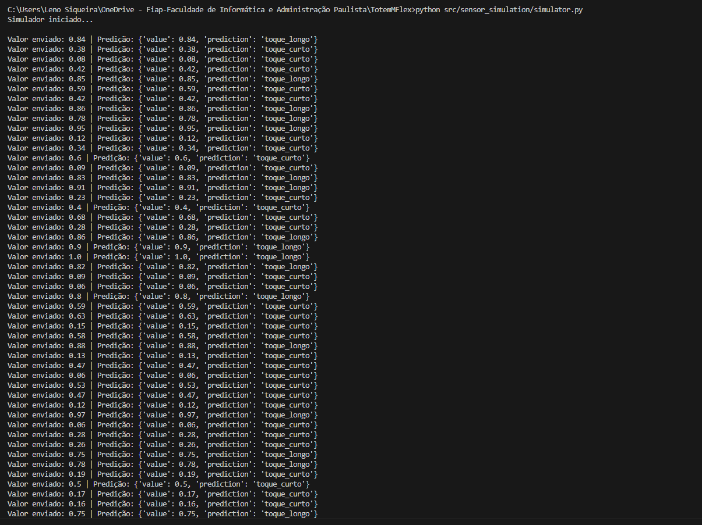
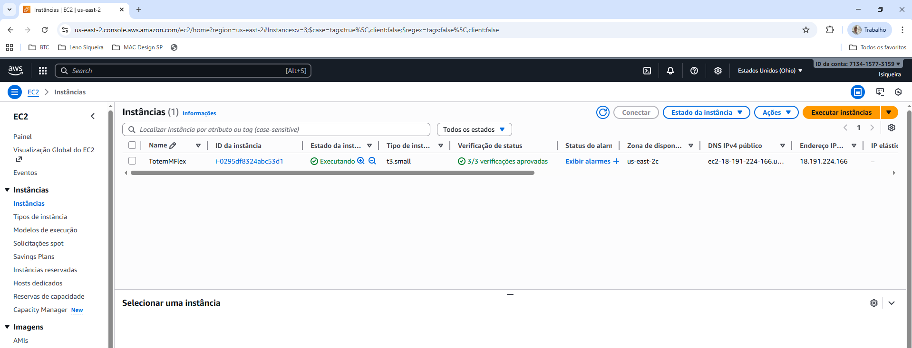
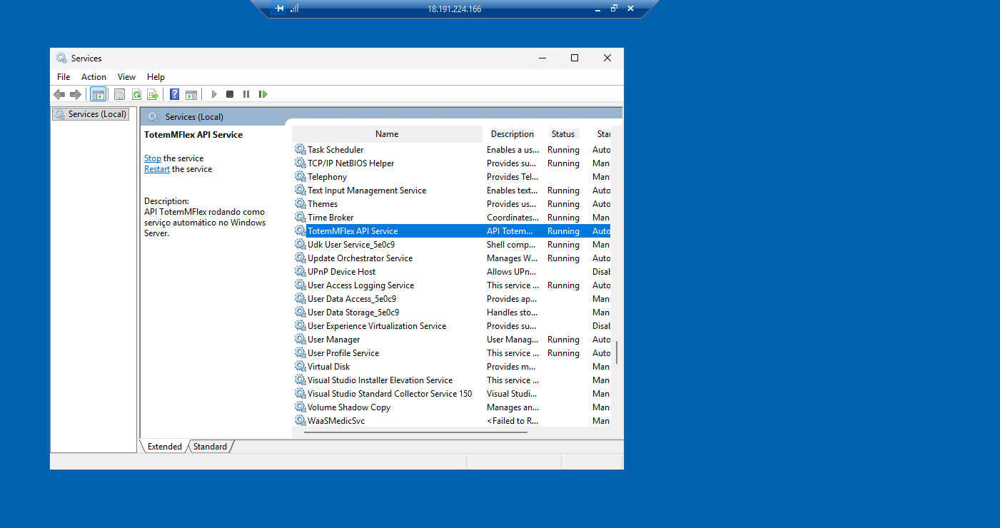
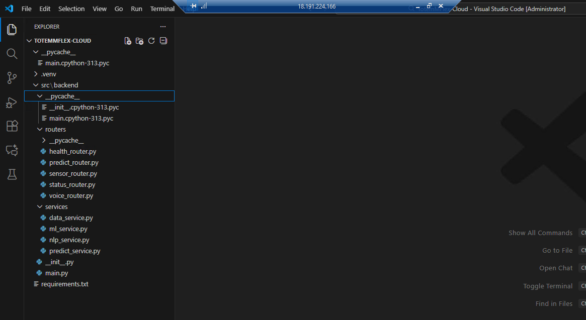
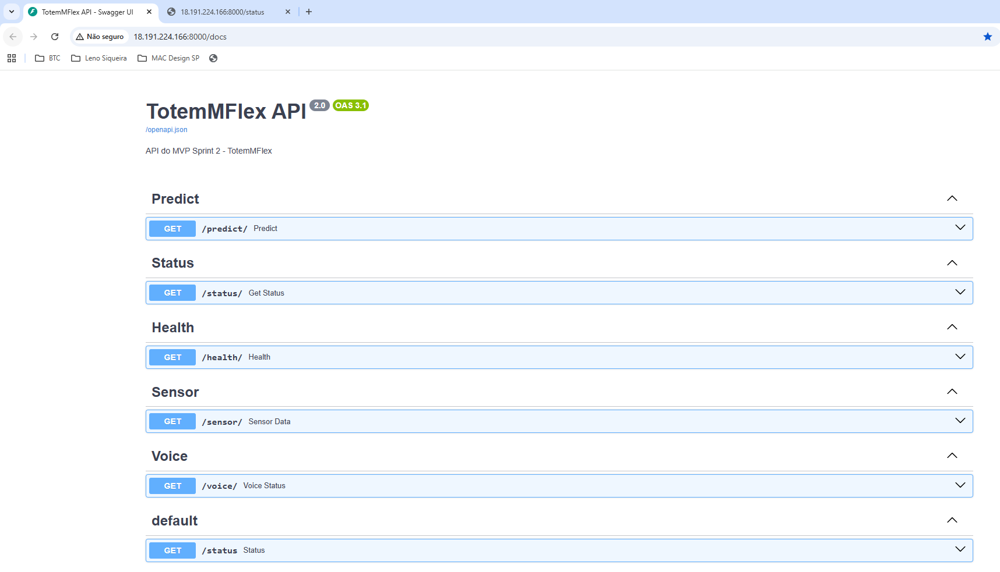
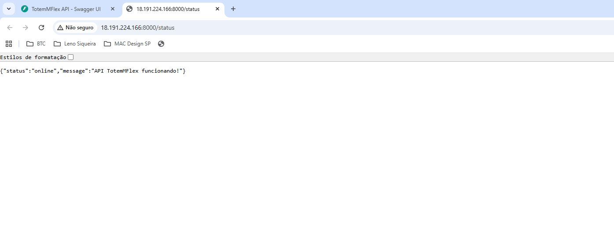

# 🟦 FIAP - Faculdade de Informática e Administração Paulista

<p align="center">
  
</p>

# 🟩 **TotemMFlex – Evolução do Totem-IA Educacional**  
### *Sprint 2 — Sistema Inteligente de Engajamento Corporativo*  
**Challenge FlexMídia — FIAP 2025**

Repositório oficial:  
https://github.com/lnosiqueira/TotemMFlex - PRIVADO

> ⚡ **O TotemMFlex é a evolução direta do projeto Totem-IA Educacional (Sprint 1).**  
> O arquivo completo da Sprint 1 está em:  
> `document/README_SPRINT1.md`

---

## 👨‍🎓 Integrantes — Grupo S (Turma 55)

- <a href="https://www.linkedin.com/in/leno-siqueira-36789544?utm_source=share_via&utm_content=profile&utm_medium=member_ios">Leno Siqueira</a> — RM: 567893  
- <a href="https://www.linkedin.com/in/paulo-benfica-76057a7b">Paulo Benfica</a> — RM: 567648  
- <a href="https://www.linkedin.com/in/federico-villagra-97378838a">Fred Villagra</a> — RM: 567187  
- <a href="https://www.linkedin.com/in/math-penteado-1b4807200/">Mateus Lima</a> — RM: 568518  

---

## 👩‍🏫 Professores Responsáveis

### Tutor(a) 
- <a href="https://www.linkedin.com/in/sabrina-otoni-22525519b?utm_source=share_via&utm_content=profile&utm_medium=member_ios/">Sabrina Otoni FIAP</a>
### Coordenador(a)
- <a href="https://www.linkedin.com/company/inova-fusca/">André Godoi FIAP</a> 

---

# 🧠 **Visão Geral do Projeto**

O TotemMFlex representa a evolução natural do Totem-IA Educacional, transformando um protótipo acadêmico em um **sistema corporativo inteligente**, modular, integrado e escalável.

A Sprint 2 entregou:

- 🌐 **API completa em FastAPI**  
- 🤖 **Pipeline de predição ML simplificado (toque curto / toque longo)**  
- 📡 **Simulador de sensores em tempo real**  
- 🗃 **Banco de dados SQLite**  
- 📊 **Dashboard em Streamlit (local + cloud)**  
- 🏗 **Arquitetura local revisada**  
- ☁️ **Deploy completo na AWS EC2**  
- 🔁 **API executando como serviço automático no Windows Server**  
- ✔ **Documentação + prints reais + diagramas**

---

# 🧱 **Arquitetura – Ambiente Local**



---

# 🔄 **Fluxo de Dados – Sprint 2**



---

# 📁 **Estrutura Oficial do Projeto**

```
TotemMFlex/
├── data/
├── diagrams/
├── document/
├── hardware/
└── src/
    ├── assets/
    │   ├── logo-fiap.png
    │   └── prints/
    │        ├── 01_project_structure.png
    │        ├── 02_estrutura_local.png
    │        ├── 03_api_backend_logs.png
    │        ├── 04_api_status.png
    │        ├── 05_swagger_predict_curto.png
    │        ├── 06_swagger_predict_longo.png
    │        ├── 07_simulator_running.png
    │        ├── 08_database_select.png
    │        ├── 09_dashboard_main.png
    │        ├── 10_aws_EC2_instance.png
    │        ├── 11_aws_service_auto.png
    │        ├── 12_aws_estrutura_cloud.png
    │        ├── 13_swagger_cloud.png
    │        └── 14_dashboard_cloud.png
    │
    ├── backend/
    │   ├── routers/
    │   ├── services/
    │   ├── main.py
    │   └── __init__.py
    │
    ├── dashboard/
    ├── sensor_simulation/
    ├── database/
    └── ml_model/
```

---

# 🚀 **Backend – FastAPI (Local)**

## 🔌 Logs da API


---

## 🔎 Endpoint `/status`


---

## 🤖 Endpoint `/predict`

### Toque Curto


### Toque Longo


---

# 🗃 **Banco de Dados (SQLite)**


---

# 📡 **Simulador de Sensores**


---

# 📊 **Dashboard — Local**


---

# ☁️ **Ambiente Cloud – AWS EC2**

## 🟦 Instância Ativa



---

## ⏱ API como Serviço Automático (Windows Server)



---

## 🗂 Estrutura do Projeto na Nuvem



---

## 🌐 Swagger – Cloud



---

## 📊 Dashboard – Cloud



---

# ▶️ **Como Executar – Local**

### Ativar venv
```
venv\Scripts\activate
```

### Instalar dependências
```
pip install -r requirements.txt
```

### Rodar API
```
uvicorn src.backend.main:app --reload
```

### Rodar simulador
```
python src/sensor_simulation/simulator.py
```

### Rodar dashboard
```
streamlit run src/dashboard/app.py
```

---

# ☁️ **Como Executar – AWS EC2**

1. Conectar via RDP  
2. Ativar venv  
3. Instalar dependências  
4. API inicia automaticamente pelo serviço:  
   **TotemMFlex API Service**  
5. Acessar no navegador:  
```
http://18.191.224.166:8000/status
http://18.191.224.166:8000/docs
```
---

# ✔ **Entregáveis da Sprint 2**

- Arquitetura Local ✔  
- Arquitetura Cloud ✔  
- API FastAPI ✔  
- ML simplificado ✔  
- Simulador ✔  
- Banco SQLite ✔  
- Dashboard ✔  
- Serviço automático Windows ✔  
- Prints ✔  
- Diagramas ✔  
- Documentação completa ✔  

---

# 🏁 **Conclusão**

A Sprint 2 consolidou o TotemMFlex como um MVP **real**, funcional, modular e pronto para expansão.  
O sistema opera em ambiente local e em nuvem, inclui ML, API, dashboard, banco e simulador — tudo validado e documentado.

> 🔥 **Este README é a versão final para entrega na FIAP e para uso no GitHub.**
